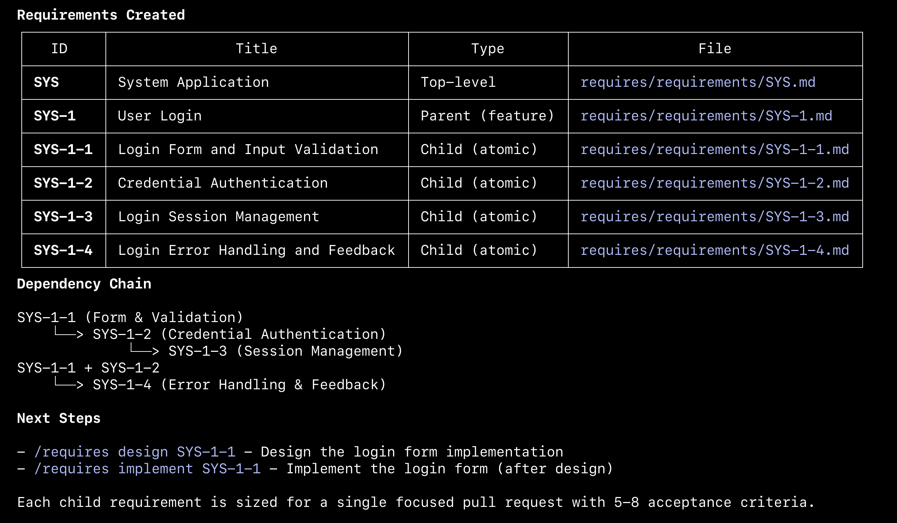

# Requires Example
Example application with User authentication requirements

### Input

```bash
$ npx @technicallycorrect/requires init
$ claude "/requires 'As a User, I want to login in to the System with my email address and password.'" 
```

### Output

